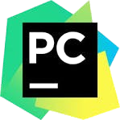
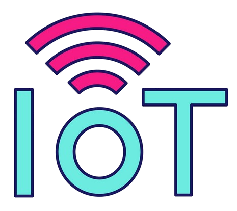

-  Hello! I’m harikrishnan
- Interested in embedded systems and IoT technologies
- Reach me: harikrishnankp14@gmail.com

 

## Technologies  
                

<!---
Thelastblackpearl/Thelastblackpearl is a ✨ special ✨ repository because its `README.md` (this file) appears on your GitHub profile.
You can click the Preview link to take a look at your changes.
--->
